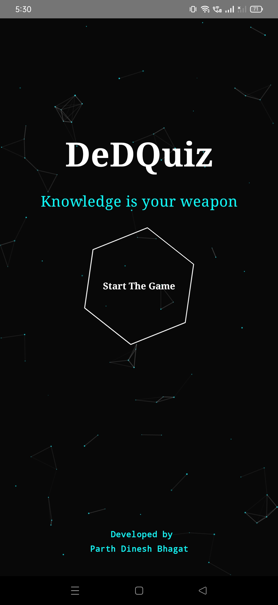
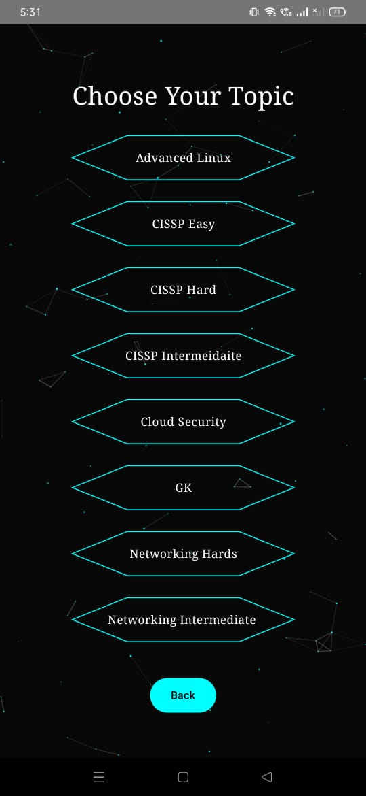
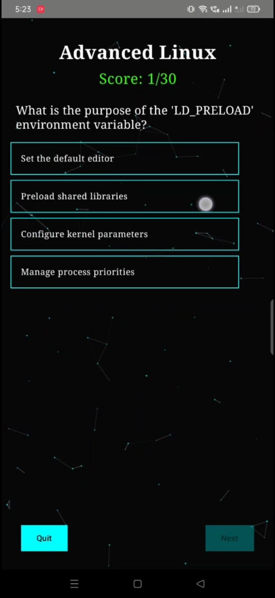
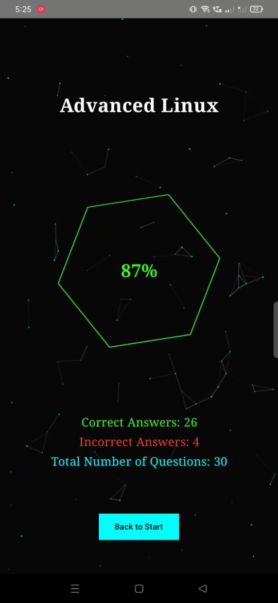

# DeDQuiz [CTOS Theme - MCQ Application]
> *"Knowledge is your weapon"*
A sleek and animated quiz game built with **Jetpack Compose**, featuring real-time topic fetching from **Firebase**, glitch-style UI animations, and interactive navigation.
--------------------------------------------------------------------------------------------------------
## 🧠 What is DeDQuiz?
DeDQuiz is a  Android quiz application that I have created so as to test my knowledge and practice MCQ's like for CISSP, ComptiA or say GK etc. without any ads and subscriptions. It loads mcq from firebase real-time database. If you use it and want me to update mcq of any kind do let me know.

It uses **Kotlin**, **Jetpack Compose**, and **Firebase Realtime Database** to deliver a fast and responsive quiz experience.
--------------------------------------------------------------------------------------------------------
## 📷 Screenshots

    
  
    
  

## 🎥 Demo Video
Watch a short demo of DeDQuiz in action:

    

--------------------------------------------------------------------------------------------------------
## 🔍 Features

- 🌀 **Animated Intro Screen** with glitching text and rotating hexagon graphics  
- 🔌 **Firebase Integration** to dynamically load quiz topics using JSON Database. 
- 🧭 **Navigation Component** with argument passing between screens  
- 🖼️ **Custom UI Components**: Hexagon buttons, glitch text, typing animation  
- 📱 Responsive layout with beautiful transitions  
- 🎮 Topic-based multiple choice quizzes  
- 🏁 Result screen showing score and allowing restart  
--------------------------------------------------------------------------------------------------------
## 🛠️ Technologies Used

| Technology | Description |
|----------|-------------|
| Kotlin | Primary programming language |
| Jetpack Compose | Modern declarative UI toolkit |
| Firebase Realtime Database | JSON Database Backend for storing quiz topics |
| Navigation Component | For navigating between quiz screens |
| Custom Animations | Using `animateFloatAsState`, infinite transitions, and Canvas drawing |

--------------------------------------------------------------------------------------------------------
## 🚀 How to Run the App

Download the binary https://github.com/parthbhagat1337/DeDQuiz-App-apk/releases/download/apk/DeDQuiz.apk  - DeDSec.apk and install it on android and enjoy.

